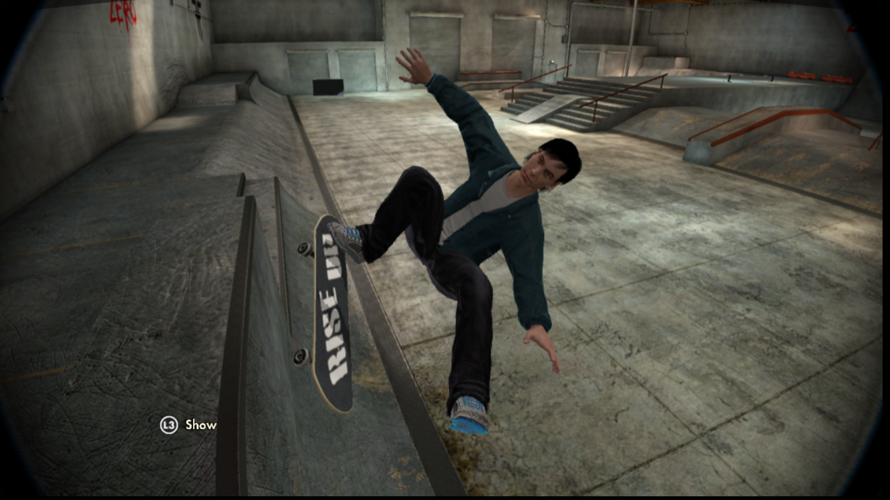

# My Tool-kit / Manual for skate 3 mods

Small project I am currently working on to help make modding textures in Skate 3 (RPCS3 - PS3) more user friendly.

### Special Mentions
Just wanted to say a special thanks to the people who have contributed towards this project.
  - [GHFear's Youtube](https://www.youtube.com/watch?v=JG-TRIlTzpQ&ab_channel=GHFear) for the initial manual tutorial!
  - [dustpancake](https://github.com/dustpancake) for helping with manipulating hexidecimal files

### Current Progress
 - have successfully manually modded my own custom logo onto (RISE UP) griptape into the game on one deck (in game screenshot below).
 - created a batch file to automate removing `INSTALL` data in RPCS3, which is required each time you launch modded Skate 3
 - created a bathc file to import any mods I make directly into the ps3 rom dir on a machine
 - made a python script for merging the games orginal `.psg` file with modded `.dds` files, to make a new playable modded `.psg` file.

  

