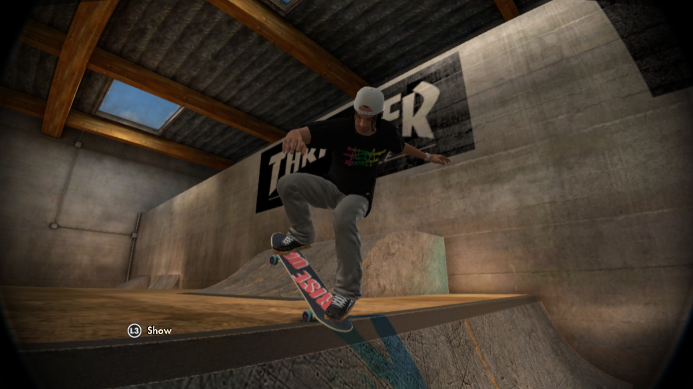
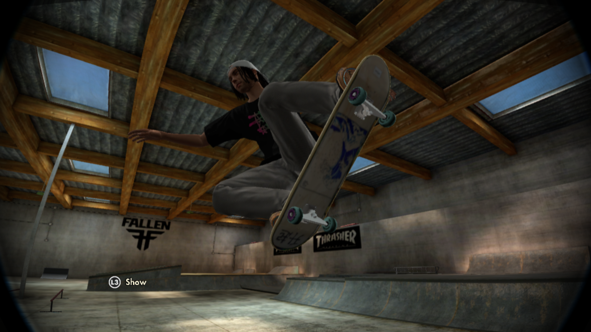

# Skate-3-Texture-Tools

Small project I am currently working on to help make modding textures in Skate 3 (RPCS3 - PS3) more user friendly.

### Special Mentions
Just wanted to say a special thanks to the people who have contributed towards this project.
  - [GHFear's Youtube](https://www.youtube.com/watch?v=JG-TRIlTzpQ&ab_channel=GHFear) for the initial manual tutorial!
  - [dustpancake](https://github.com/dustpancake) for helping with manipulating hexidecimal files

### [Current Progress](https://github.com/Shellywell123/Skate-3-Texture-Tools/blob/main/docs/current-progress.md)
 - manually modded my own custom logo onto (RISE UP) griptape into the game follwing [GHFear's tutorial](https://www.youtube.com/watch?v=JG-TRIlTzpQ&ab_channel=GHFear) (in game screenshot below).
 - created a `.bat` script to automate removing `INSTALL` data in RPCS3, which is required each time you launch modded Skate 3
 - created a `.bat` script to automate importing my modded textures into the RPCS3 Skate 3 ROM directory on my machine
 - created a `.bat` script to automate extracting `.big` files into `.psg` files in correct folder structure
 - created a `.py` script to automate merging the PS3 formatted meta data of a `.psg` file with the modded image data in a `.dds` files, to generate a new playable modded `.psg` file.

  
  

