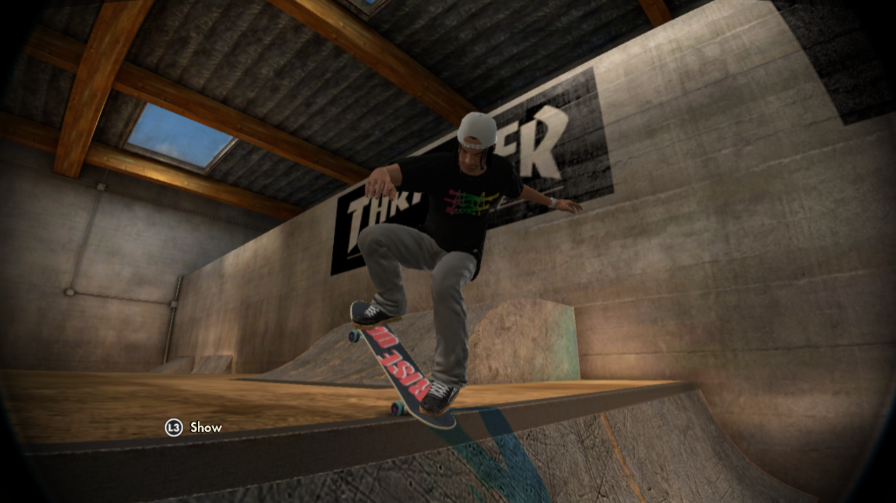
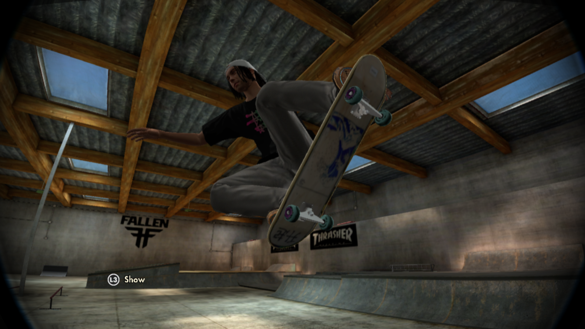
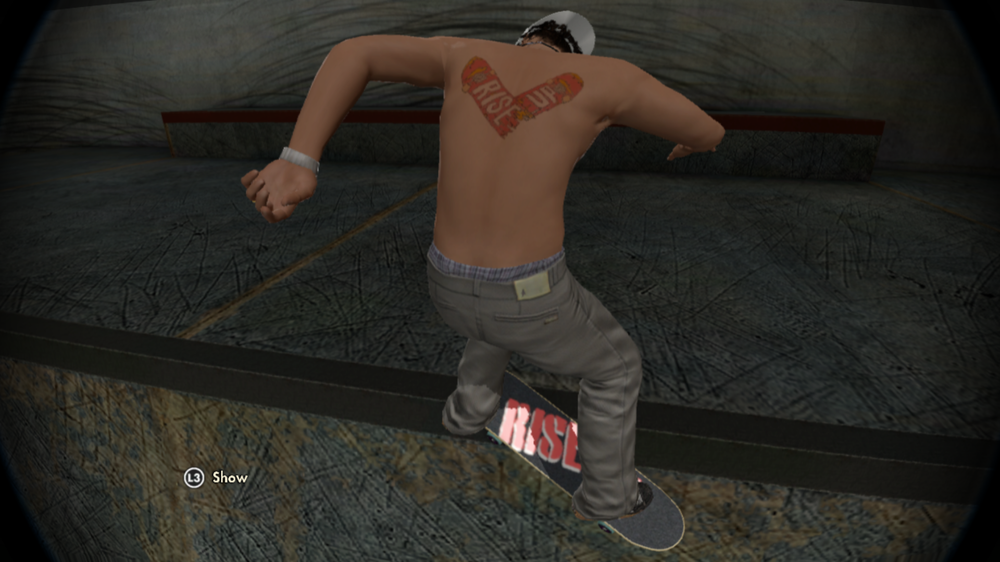
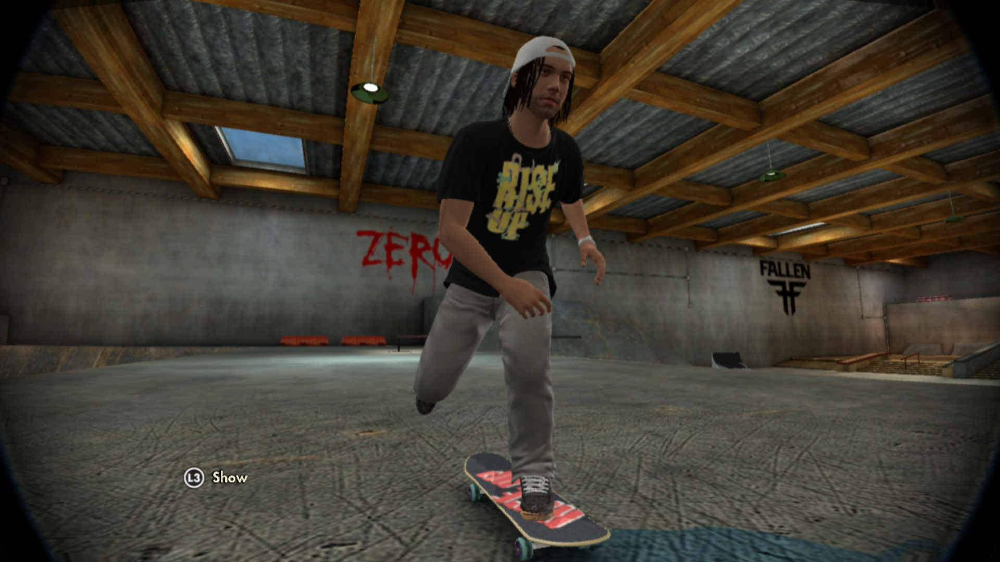
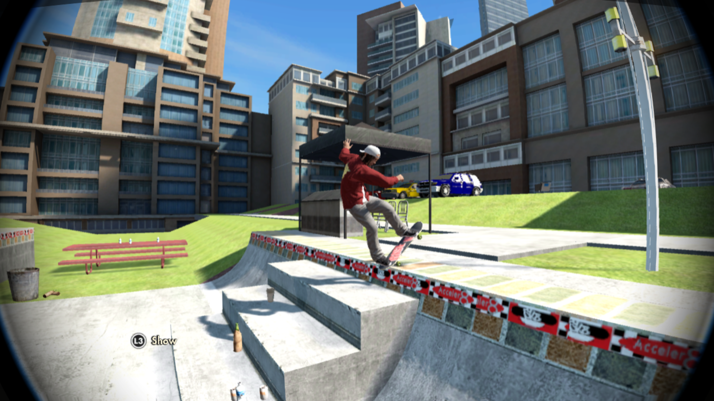

# Skate-3-Texture-Tools

Small project I am currently working on to help make modding textures in Skate 3 (RPCS3 - PS3) more user friendly.

### Special Mentions
Just wanted to say a special thanks to the people who have contributed towards this project.
  - [GHFear's Youtube](https://www.youtube.com/watch?v=JG-TRIlTzpQ&ab_channel=GHFear) for the initial manual tutorial!
  - [dustpancake](https://github.com/dustpancake) for helping with manipulating hexidecimal files

  
  
  
  
  
  

### [Current Progress](https://github.com/Shellywell123/Skate-3-Texture-Tools/blob/main/docs/current-progress.md)

Currently Moddable:
 - "Create a character" textures such as clothing, skateboard parts, tattoos and brand decals
 - "Park Creator" object textures such as ledge spines and coping

Currently UnModdable:
 - Menu textures
 - Start screen
 - Map textures such as sky or ground

Created batch files:
 - to automate removing `INSTALL` data in RPCS3, which is required each time you launch modded Skate 3
 - to automate importing my modded textures into the RPCS3 Skate 3 ROM directory on my machine
 - to automate extracting multiple `.big` files into `.psg` files in correct folder structure
 - to automate extracting every nested `.psg` file in a direcory into an identically nested `.dds` file using `Noesis` in cmdline mode.
 - as a main menu to call all the above batch scripts
 
Created a Python scripts (to be rewritten as batch):
- to automate merging the PS3 formatted meta data of a `.psg` file with the modded image data in a `.dds` files, to generate a new playable modded `.psg` file. (soon to be made batch)

### Current Usage
(Still very much a work in progress, but feel free to try out my code and give feedback)

  

[how-to-use](https://github.com/Shellywell123/Skate-3-Texture-Tools/blob/main/docs/how-to-use.md)
