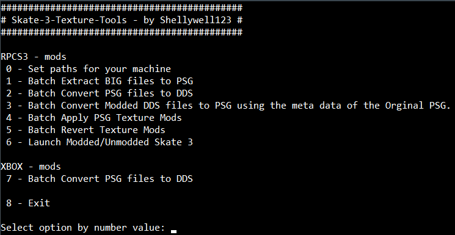

# Skate-3-Texture-Tools

Commandline tool to aid modding Skate 3 game Textures (RPCS3 - PS3 / Xenia - Xbox).
I plan to create a proper winforms application at some stage.

  
  
  
  
  
  

### [Current Progress](https://github.com/Shellywell123/Skate-3-Texture-Tools/blob/main/docs/current-progress.md)

Moddable Textures:
* [x] "Create a character" textures such as clothing, skateboard parts, tattoos and brand decals
* [x] "Park Creator" object textures such as ledge spines and coping
* [ ] Menu textures
* [ ] Start screen
* [ ] Map textures such as sky or ground

Batch Scripts:
 - automate removing `INSTALL` data in RPCS3, (required each time you launch modded Skate 3 in RPCS3)
 - automate importing modded textures into the RPCS3 Skate 3 ROM directory
 - automate extracting multiple `.big` files into `.psg` files in correct folder structure
 - automate extracting all nested `.psg` files in a direcory into an identically nested `.dds` file using `Noesis` in cmdline mode.
 - main menu to call all the above batch scripts
 
Python scripts (to be rewritten as batch):
- automate merging the PS3 formatted meta data of a `.psg` file with the modded image data in a `.dds` files, to generate a new playable modded `.psg` file.

### Current Usage

  

[how-to-use](https://github.com/Shellywell123/Skate-3-Texture-Tools/blob/main/docs/how-to-use.md)

### Special Mentions
Just wanted to say a special thanks to the people who have contributed towards this project.
  - [GHFear's Youtube](https://www.youtube.com/watch?v=JG-TRIlTzpQ&ab_channel=GHFear) for the initial manual tutorial!
  - [dustpancake](https://github.com/dustpancake) for helping with manipulating hexidecimal files

